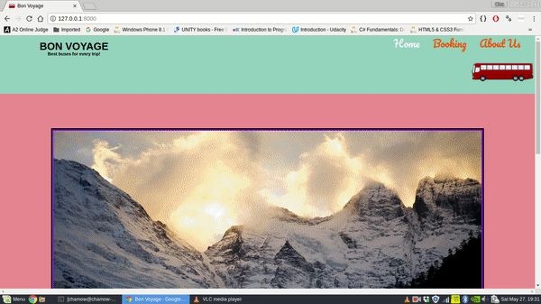
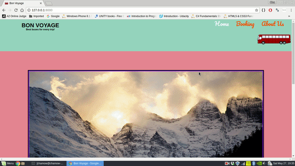

<h1>Bon-Voyage-Bus-Reservation </h1>

<h3>Introduction</h3>

Bon-Voyage is a bus reservation system which gives user an option to have an account and book tickets.

<h3>Website Sample</h3>
<h4>Home and About Pages :</h4>
</img>
<h4>Booking Tickets :</h4>
</img>

<h3>Languages Used: </h3>
<ul>
<li>Front end: HTML, CSS, JQuery(JS).</li>
<li>Back end: Django(python framework).</li>
</ul>

<h3>How to run the app?</h3>
<ol>
<li>Install Python3 and Django using the below code.(You need pip to install django) 
<code>sudo apt-get install python3</code>
 
<code>pip install django</code>
</li>
<li>Download the project and unzip it.</li>
<li>Open a terminal or Windows Power Shell and navigate to this project.</li>
<li>Type the following commands.
 
<code>python3 manage.py migrate</code>
 
<code>python3 manage.py runserver</code>
</li>
<li>Open a browser and type:</li>
<ul>
<li>127.0.0.1/admin - to manage users.</li>
<li>127.0.0.1/ - to run the app.</li>
</ul>
</ol>
<h3>Future Works</h3>
<ul>
<li>Mail users their tickets.</li>
<li>Give visual reprsentation of seating arrangements in the bus and ability to book specific seats.</li>
<li>Show route map of a bus.</li>
</ul>
 

Thank you for using this application. For any queries contact me at : chamow97@hotmail.com. 

